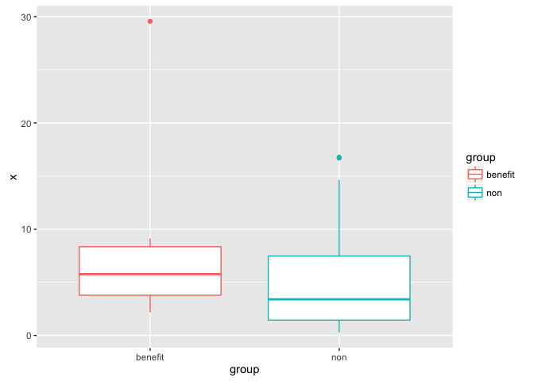
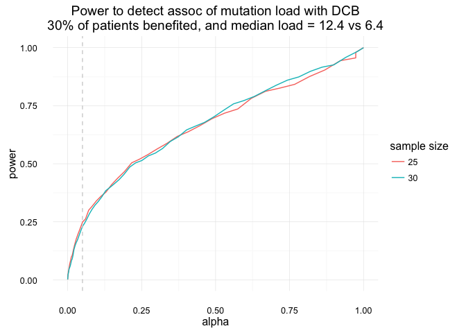

Estimate power for mutational load &lt;&gt; PFS
================
Jacqueline Buros
September 20, 2016

Introduction
------------

In general, we will estimate the power to detect a "significant" effect using simulation.

The process to do this is fairly straightforward:

1.  Write a function to simulate data according to the alternative hypothesis (H1)
2.  Repeat the data simulation X times (we choose X=1000)
3.  Analyze each replicated dataset as you would the real data (ie do the same statistical test)
4.  Compute the power to detect an effect at p &lt; alpha (ie, the proportion of trials with p &lt; alpha)

The Plan
--------

In our case, we have a fixed sample size of ~29 patients, so we treat this as given.

We want to simulate `mutation_load` values for `benefit` and `non-benefit` patients, which will be similar to those observed in the Rosenberg et al 2016 cohort. The only difference in our simulations should be the reduced sample size -- they had a sample size of ~150 patients whereas we will use a sample size of ~29.

The question at hand is, if we saw the same association in our cohort as they saw in the larger cohort, would this be statistically significant?

They observed

1.  median mutation load among benefit patients of 12.4
2.  median mutation load among non-benefit patients of 6.4
3.  approx 20% of patients had a durable reponse

We will use these values in our simulations.

Data simulation
---------------

One challenge in simulating these data is that the Rosenberg et al. paper used a non-parametric statistical test, and so we do not have an easy parametric form from which to simulate these data.

As a starting point, we will try using an exponential distribution to simulate these data, since counts are often distributed exponentially. Note that this is a parameter that we can modify later if it doesn't work well; we will start here and see how reasonable the simulated data are.

``` r
library(tidyverse)

## generate simulated data 
sim_data <- function(index = 1, 
                     n = 30,
                     loc_benefit = 12.4,
                     loc_non = 6.4,
                     prop_benefit = 0.2
) {
  n_benefit = n*prop_benefit
  n_non = n*(1-prop_benefit)
  sim_f = function(n, loc) rexp(n = n, rate = 1/loc)
  x_benefit <- sim_f(n = n_benefit, loc = loc_benefit)
  x_non <- sim_f(n = n_non, loc = loc_non)
  df <- tbl_df(list(x = x_benefit, group = 'benefit')) %>%
    bind_rows(tbl_df(list(x = x_non, group = 'non')))
  df
}
```

Notice that we have put default values here which match those we observed in the Rosenberg et al publication.

We can use this function to simulate a dataset like so:

``` r
df <- sim_data()
df %>% head()
```

    ## # A tibble: 6 × 2
    ##           x   group
    ##       <dbl>   <chr>
    ## 1  2.180910 benefit
    ## 2 29.556676 benefit
    ## 3  5.523065 benefit
    ## 4  9.126047 benefit
    ## 5  3.209550 benefit
    ## 6  6.017778 benefit

Here is a plot of these simulated data:

``` r
ggplot(df, aes(y = x, x = group, group = group, colour = group)) +
  geom_boxplot()
```



Simulating replicate samples
----------------------------

Next we will generate 1000 simulations, each using the same default inputs.

``` r
sim_df <- 
  rep_along(x = 1:1000, c(25, 30)) %>%
  map_df(~ sim_data(n = .), .id = 'id')
```

This results in a single data frame containing 1000 datasets for each value of n (here `25` & `30`).

``` r
sim_df %>%
  group_by(id) %>%
  summarize(given_n = n()) %>%
  head()
```

    ## # A tibble: 6 × 2
    ##      id given_n
    ##   <chr>   <int>
    ## 1     1      25
    ## 2    10      30
    ## 3   100      30
    ## 4  1000      30
    ## 5   101      25
    ## 6   102      30

Let's add this calculated value back into the simulated dataframe.

``` r
sim_df <- 
  sim_df %>%
  group_by(id) %>%
  mutate(given_n = n()) %>%
  ungroup()
```

Computing results for each simulation
-------------------------------------

Next, we summarize the median by DCB-group for each simulation so that we can see how well our simulated data matches the observed values in the Rosenberg publication.

``` r
median_summary <- sim_df %>%
  group_by(id, given_n, group) %>%
  summarize(median = median(x)) %>% 
  ungroup() %>%
  spread(key = group, value = median)
```

The result is a data frame containing the median values among benefit & non-benefit groups for each simulation.

``` r
median_summary %>% head()
```

    ## # A tibble: 6 × 4
    ##      id given_n   benefit      non
    ##   <chr>   <int>     <dbl>    <dbl>
    ## 1     1      25 10.368410 6.829914
    ## 2    10      30  5.295673 4.486547
    ## 3   100      30 13.312033 3.307429
    ## 4  1000      30 10.805258 3.231977
    ## 5   101      25  8.301236 4.751942
    ## 6   102      30  9.535457 4.914471

Finally, we apply the wilcoxon ranksum (aka Mann Whitney U) test to each sample, and join these results to our summary of medians by group.

``` r
## compute mann whitney u (wilcoxon ranksum) 
## statistical test for each replicate
res <- sim_df %>%
  split(.$id) %>%
  map_df(~ broom::tidy(wilcox.test(x ~ group, data = .)), .id = 'id') %>%
  inner_join(median_summary, by='id')
```

The resulting data.frame contains the results of the analysis for each simulation.

``` r
res %>% head()
```

    ##     id statistic    p.value                 method alternative given_n
    ## 1    1        52 0.92147563 Wilcoxon rank sum test   two.sided      25
    ## 2   10        72 1.00000000 Wilcoxon rank sum test   two.sided      30
    ## 3  100       115 0.02463896 Wilcoxon rank sum test   two.sided      30
    ## 4 1000       101 0.14263652 Wilcoxon rank sum test   two.sided      30
    ## 5  101        65 0.33555430 Wilcoxon rank sum test   two.sided      25
    ## 6  102        91 0.34674751 Wilcoxon rank sum test   two.sided      30
    ##     benefit      non
    ## 1 10.368410 6.829914
    ## 2  5.295673 4.486547
    ## 3 13.312033 3.307429
    ## 4 10.805258 3.231977
    ## 5  8.301236 4.751942
    ## 6  9.535457 4.914471

Summarizing results
-------------------

The power to detect an effect at *α* &lt;= 0.05 is approximated by the proportion of simulations yielding a p-value &lt; *α*.

It is fairly trivial to calculate this as:

``` r
res %>% 
  group_by(given_n) %>%
  summarize(power = mean(p.value < 0.05))
```

    ## # A tibble: 2 × 2
    ##   given_n power
    ##     <int> <dbl>
    ## 1      25 0.222
    ## 2      30 0.210

We can also plot the power at different levels of alpha, by computing the cumulative proportion of samples with p&lt;=*α*.



Evaluating quality of simulated datasets
----------------------------------------

However, it's useful to keep in mind that our power calculation here is only as good as the data simulations we used to generate it.

It's thus equally as important to inspect the simulated data, both graphically and numerically.

Following are some plots that may aid in this process:


    ## Joining, by = "id"

    ## Joining, by = c("id", "given_n")


